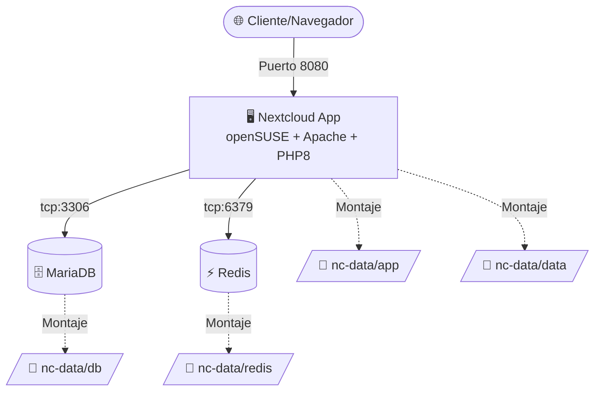

# Nextcloud All-in-One (openSUSE)

Entorno completo de Nextcloud basado en **openSUSE Leap 15.5** usando Docker Compose.

---

## 🗺️ Arquitectura



---

## ⚙️ Variables de Entorno (`.env`)

* `HOST_PORT`: Puerto de acceso en el host (ej. `8080`).
* `MYSQL_ROOT_PASSWORD`: Contraseña root de MariaDB.
* `MYSQL_DATABASE`: Nombre de la base de datos (por defecto: `nextcloud`).
* `MYSQL_USER`: Usuario de la base de datos.
* `MYSQL_PASSWORD`: Contraseña de la base de datos.
* `REDIS_HOST_PASSWORD`: Contraseña para Redis.

> [!TIP]
> Si usas base de datos externa, elimina el servicio `db` de `docker-compose.yml`.

---

## 🚀 Instalación y Arranque

1. Configura las contraseñas en `.env`.
2. Ejecuta:

```bash
docker-compose up -d --build
```

3. Accede a `http://localhost:8080` en tu navegador.
4. Configura el primer usuario administrador.
5. Configura la conexión de Base de Datos:

* Usuario: `nextcloud` (o tu variable `MYSQL_USER`).
* Contraseña: La misma de `MYSQL_PASSWORD`.
* Base de datos: `nextcloud`.
* Host: `db`.
